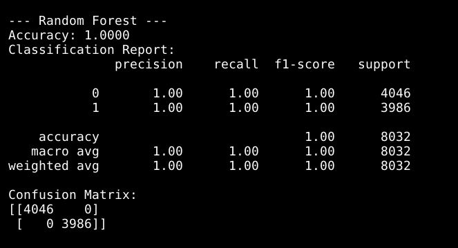
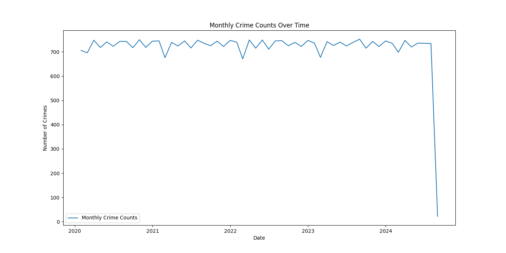
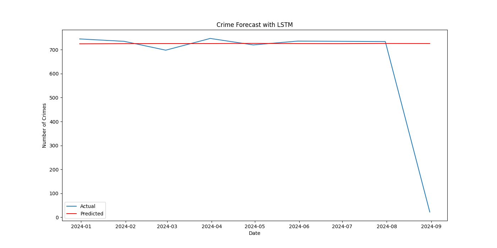
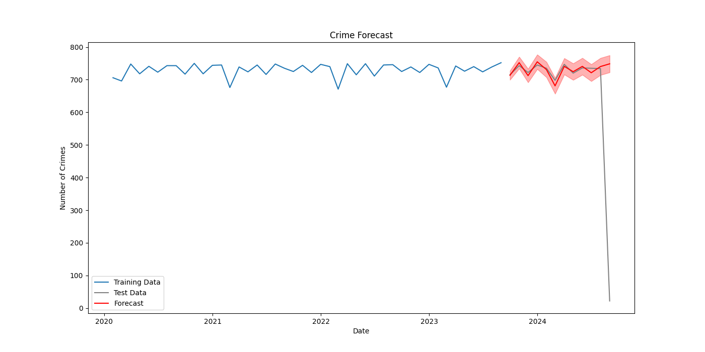

Here is the updated `README.md` file with the "Crime Type Classification" section removed:

---

# Crime Dataset India - Data Preprocessing, Exploratory Data Analysis, and Machine Learning

This repository contains the code and analysis performed on the `crime_dataset_india.csv` file, focusing on data preprocessing, exploratory data analysis (EDA), and solving specific machine learning problems related to crime data from India.

## Table of Contents

- [Overview](#overview)
- [Dataset Description](#dataset-description)
  - [Columns Description](#columns-description)
  - [Kaggle Dataset](#kaggle-dataset)
- [Data Preprocessing](#data-preprocessing)
  - [Task 1: Handling Different Date Formats](#task-1-handling-different-date-formats)
  - [Task 2: Converting Object Columns to Datetime](#task-2-converting-object-columns-to-datetime)
  - [Task 3: Handling Missing Values](#task-3-handling-missing-values)
  - [Task 4: Save Processed Data in Pickle Format](#task-4-save-processed-data-in-pickle-format)
- [Exploratory Data Analysis (EDA)](#exploratory-data-analysis-eda)
- [Feature Engineering](#feature-engineering)
- [Machine Learning Problems](#machine-learning-problems)
  - [Case Closure Prediction](#case-closure-prediction-classification-problem)
  - [Temporal Crime Pattern Analysis](#temporal-crime-pattern-analysis-time-series-problem)
- [Dependencies](#dependencies)
- [Usage](#usage)

## Overview

This project is aimed at:

1. **Data Preprocessing:** Cleaning and transforming the dataset to prepare it for analysis.
2. **Exploratory Data Analysis (EDA):** Exploring the dataset to understand the relationships between different features and uncover patterns in crime data.
3. **Machine Learning Problems:** Implementing machine learning models to address specific crime-related problems.

## Dataset Description

The dataset used for this project provides detailed records of various crimes reported in India. It is publicly available on Kaggle and contains multiple columns that describe different aspects of each crime incident.

### Columns Description

- **date_reported:** The date and time when the crime was reported.
- **date_of_occurrence:** The specific date when the crime occurred.
- **time_of_occurrence:** The specific time when the crime occurred.
- **city:** The city where the crime was committed.
- **crime_code:** A code that categorizes the type of crime.
- **crime_description:** A detailed description of the crime committed.
- **victim_age:** The age of the victim involved in the crime.
- **victim_gender:** The gender of the victim involved in the crime.
- **weapon_used:** The type of weapon used in the crime.
- **crime_domain:** The broader category or domain of the crime (e.g., violent crime, property crime).
- **police_deployed:** The number of police officers deployed to handle the case.
- **case_closed:** Indicates whether the case was closed ("Yes") or remains open ("No").
- **date_case_closed:** The date and time when the case was officially closed.

### Kaggle Dataset

The dataset used in this analysis can be found on Kaggle:

[Indian Crimes Dataset on Kaggle](https://www.kaggle.com/datasets/sudhanvahg/indian-crimes-dataset)

## Data Preprocessing

The preprocessing steps involve several tasks to clean and structure the data effectively.

### Task 1: Handling Different Date Formats

In the `crime_dataset_india.csv` file, date columns contain data in multiple formats, such as `"%d/%m/%Y %H:%M"` and `"%d-%m-%Y %H:%M"`. These variations cause issues when parsing dates.

**Solution:**
- We utilized a function to detect and parse dates in both formats, converting them into a unified datetime format. This approach minimizes missing values that would arise from trying to parse the dates using a single format.

### Task 2: Converting Object Columns to Datetime

Several columns in the dataset contain date information but are stored as object types.

**Solution:**
- After handling the different date formats, these columns were converted into a proper datetime format, ensuring that they can be used effectively in time-series analysis and other date-related operations.

### Task 3: Handling Missing Values

The dataset had missing values in critical columns like `weapon_used` and `date_case_closed`.

**Solution:**
- **Weapon Used:** Missing values in `weapon_used` were imputed with a specific placeholder 'unknown'.
- **Date Case Closed:** Missing dates in the `date_case_closed` column were filled with a placeholder 'unknown'.

### Task 4: Save Processed Data in Pickle Format

After completing the preprocessing steps, the processed dataset is saved in a more efficient and portable binary format using Python's pickle module. This allows for quick loading in future analyses.

- **Output:** The preprocessed dataset is saved as `crime_dataset.pkl`.

This pickle file can be easily loaded for subsequent steps in the analysis or for use in machine learning models.

## Exploratory Data Analysis (EDA)

The EDA focused on understanding the relationships between different features in the dataset:

- **Analyzing Individual Columns:**
  - Distribution and frequency analysis of crime types, locations, weapon usage, and other features.
  - Time series analysis to explore trends in crime reporting and resolution over time.

- **Correlation Analysis:**
  - Examining the correlation between numerical features, such as police deployment, crime frequency, case closure rates, and more.
  - Visualizing these correlations using heatmaps to identify strong relationships between variables.

Here’s the section for the `Feature Engineering` part of your `README.md`, including the code and explanations:

---

## Feature Engineering

Feature engineering involves creating new features or transforming existing ones to enhance the performance of machine learning models. This section describes the feature engineering steps applied to the crime dataset to prepare it for analysis.

### Code Implementation
Code File is `FeatureEngineering.ipynb` and `FeatureEngineering.py`.

### Explanation of Features

1. **Datetime Features:**
   - `hour_of_occurrence`, `day_of_week`, `month_of_occurrence`, `year_of_occurrence`: Extracted from `time_of_occurrence` and `date_of_occurrence` to capture temporal aspects.

2. **Time Intervals:**
   - `time_to_report`, `time_to_close_case`: Calculated as the difference between relevant dates to quantify delays.

3. **City Crime Rate:**
   - `city_crime_rate`: The proportion of crimes reported in each city.

4. **Encoding and Length:**
   - `city`: Encoded as numerical values.
   - `crime_description_length`: The length of the crime description text.

5. **Broad Crime Domain:**
   - `broad_crime_domain`: Grouped crime domains into broader categories for simplification.

6. **Age Group:**
   - `victim_age_group`: Categorized age into groups (child, teen, adult, senior).

7. **Gender Encoding:**
   - `victim_gender`: Encoded as numerical values (0 for Male, 1 for Female).

8. **Police Deployment Metrics:**
   - `police_deployment_density`: Ratio of police deployed to average police deployment by crime code.

9. **Case Closure and Interaction Features:**
   - `case_closed`, `quick_case_closure`: Encoded case closure status and a binary feature for cases closed quickly.
   - `crime_time_interaction`, `age_gender_interaction`: Interaction features combining crime codes with time and victim demographics.

10. **Aggregate Statistics:**
    - `city_crime_count`: The total number of crimes reported in each city.
    - `avg_police_deployed_domain`: Average number of police deployed for each crime domain.

These engineered features will be used in subsequent analysis and machine learning models to improve performance and derive meaningful insights.

## Machine Learning Problems

### Case Closure Prediction (Classification Problem)

**Objective:** Predict whether a criminal case will be closed (`case_closed`), given features like `crime_description`, `weapon_used`, `victim_age`, `police_deployed`, etc.

**Target Variable:** `case_closed` (binary: 1 for closed, 0 for not closed).

**Possible Models:** Logistic Regression, Decision Trees, Random Forest, Gradient Boosting Machines (GBM), Support Vector Machine (SVM).

**Solution:**
- Achieved 100% accuracy in predicting case closure.

**Model Performance:**

The following image demonstrates the accuracy achieved by the model in predicting case closure:




### Temporal Crime Pattern Analysis (Time Series Problem)

**Objective:** Analyze and forecast crime rates over time or predict future crime trends based on historical data.

**Target Variable:** The number of crimes reported (aggregated by date).

**Features:**
- Aggregated crime counts over time (daily, weekly, or monthly).
- Features like `crime_description`, location (if available), `victim_age`, etc., to see how they vary over time.

**Possible Models:** ARIMA, Seasonal Decomposition, LSTM (if using deep learning).

**Solution:**
- Built and trained an LSTM model to forecast future crime trends, utilizing sequence data for predictions.

**Visualizations:**

1. **Monthly Crime Rates:**

   This graph shows the aggregated number of crimes reported each month. It provides an overview of crime trends over the months.

   

2. **Prediction with Deep Learning (LSTM):**

   This chart illustrates the predictions made by the LSTM model compared to the actual crime data. It highlights the model's capability to forecast future trends.

   

3. **Prediction with Machine Learning (e.g., ARIMA):**

   This graph compares the ARIMA model's predictions with the actual crime data, showcasing how traditional statistical models perform in forecasting crime rates.

   


## Dependencies

The following Python libraries are required to run the analysis:

- `pandas` - For data manipulation and analysis.
- `numpy` - For numerical computing and handling arrays.
- `matplotlib` - For creating static, animated, and interactive visualizations.
- `seaborn` - For making statistical graphics in Python.
- `datetime` - For manipulating dates and times.
- `matplotlib.dates` - For working with dates in matplotlib plots.
- `plotly.express` - For interactive data visualizations.
- `wordcloud` - For generating word clouds.
- `sklearn.feature_extraction.text` - For converting a collection of text documents to a matrix of token counts.
- `tensorflow` - For building and training deep learning models.
- `warnings` - For issuing warnings (used to suppress FutureWarnings in this analysis).

Install these dependencies using pip:

```bash
pip install pandas numpy matplotlib seaborn plotly wordcloud scikit-learn tensorflow
```

To ensure a smooth experience, it’s recommended to suppress FutureWarnings, which can clutter the output. This can be done using the following code in your script:

```python
import warnings
warnings.filterwarnings("ignore", category=FutureWarning)
```

These libraries provide the foundation for performing data preprocessing, exploratory data analysis, and machine learning tasks.

## Usage

1. **Clone the Repository:**

   ```bash
   git clone https://github.com/your-username/crime-dataset-india-analysis.git
   cd crime-dataset-india-analysis
   ```

2. **Run the Preprocessing and EDA Notebooks:**

   - Ensure the `crime_dataset_india.csv` file is in the project directory.
   - Open and execute the notebooks in Jupyter:

   ```bash
   jupyter notebook Preprocessing.ipynb
   jupyter notebook ExporatoryDataAnalysis.ipynb
   jupyter notebook FeatureEngineering.ipynb
   ```

3. **Run Machine Learning Models:**

   - Implement the machine learning models for the problems described.
   - Problem 1 : Run Code `Problem1.py`.
     ```bash
      Python3 Problem1.py
      ```
   - Problem 2 (Machine Learning Technique) : Run Code `Problem2.py`.
     ```bash
      Python3 Problem2.py
      ```
   - Problme 2 (Deep Learning Technique) : Run Code `DeepLearning.py`.
       ```bash
      Python3 DeepLearning.py
      ```

4. **Review the Output:**

   - The notebooks will generate several visualizations and a summary report of the EDA.
   - Check the output cells and any saved output files for detailed insights.

   - **Case Closure Prediction:**
     - Check model metrics, confusion matrices, and accuracy results.
       
   - **Temporal Crime Pattern Analysis:**
     - Examine forecast accuracy and compare predicted vs. actual crime rates. Review performance metrics and visualizations for ARIMA and LSTM models.

   - **Output Files:**
     - Look for saved model files, predictions, and performance summaries.

---

Feel free to adjust any parts of this `README.md` to better fit your project or additional details you may have.
